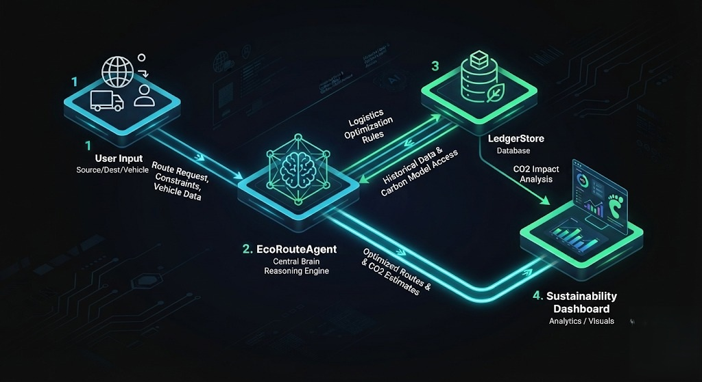
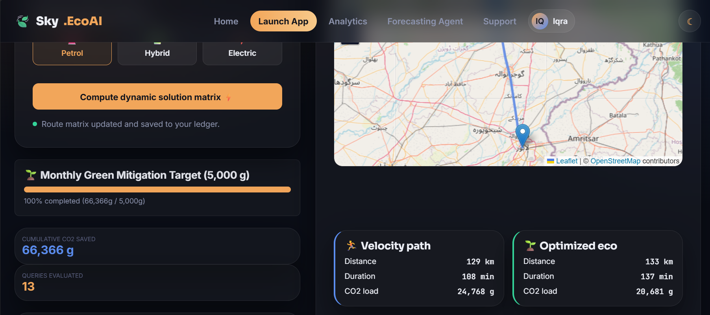
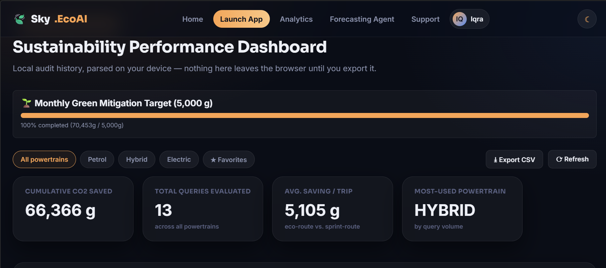

# Sky.EcoAI

Sky.EcoAI is a Fleet Logistics SaaS application built as a Python Flask project. It combines an agentic AI route optimization engine, a persistent ledger for fleet telemetry and trip history, and backend telemetry processing to support carbon-aware route planning, fleet analytics, and support automation.
[](https://www.youtube.com/watch?v=YOUR_VIDEO_ID)
## Overview

Sky.EcoAI is designed for logistics operators, fleet managers, and transportation planners who want to compare efficient route alternatives, capture route history, and analyze backend telemetry through an integrated SaaS-style experience.

The application is centered around three main capabilities:

- **Agentic AI route optimization** using the `EcoRouteAgent` class.
- **Persistent ledger storage** that saves route history, CO2 metrics, and favorite trips in `data/ledger.json`.
- **Backend telemetry processing** through Flask API endpoints for route optimization, fleet analysis, ticket automation, and export.

Sky.EcoAI also includes authentication, premium subscription handling, admin management, and support ticket workflows.

## Features

### Agentic AI Route Optimization Engine

The heart of Sky.EcoAI is the `EcoRouteAgent` component in `route_agent.py`.

- `EcoRouteAgent.optimize(source, destination, vehicle)` calculates route recommendations for sprint and green paths.
- It computes an estimated distance using a deterministic hash-based distance model and maps vehicle profiles (`petrol`, `hybrid`, `electric`) to CO2 coefficients.
- It returns:
  - source and destination
  - vehicle profile and recommendation text
  - sprint and green route metrics (distance, duration, CO2)
  - CO2 savings and percentage reduction

This route optimization engine demonstrates the agentic AI concept by acting as a decision-making component that analyzes input context, selects a vehicle profile, and generates route guidance dynamically.

### Agentic AI Workflow and Flow


Sky.EcoAI applies an agentic AI concept in these flows:

1. **Route optimization request**
   - Client submits a request to `/api/optimize` with source, destination, and vehicle type.
   - The Flask backend forwards the input to `agent.optimize(...)`.
   - The agent processes the request, simulating an ADK runtime if `google.adk` is unavailable, and produces a structured optimization response.
   - The response includes both a fast sprint path and a green path with emissions savings.

2. **Support ticket automation**
   - When a user creates a support ticket through `/api/support/ticket`, the backend saves the ticket in `SupportStore`.
   - The same agent is used to generate an AI assistant reply from the ticket subject and message.
   - The reply is stored alongside the ticket, showing how agentic AI can automate customer-facing workflows.

3. **Fleet analysis and telemetry diagnostics**
   - The `/api/analyze-fleet` endpoint uses `agent.optimize(...)` as a diagnostic helper for fleet-level messages and logical telemetry analysis.
   - The backend returns a simulated report together with carbon and fuel diagnostics.
## 📊 Project Visuals

### Real-Time Route Optimization
The dashboard provides a side-by-side comparison of "Velocity" vs "Optimized Eco" paths, allowing fleet managers to make immediate carbon-aware decisions.


### Sustainability Performance Dashboard
Our integrated telemetry dashboard tracks cumulative CO2 savings and allows for automated data exports, turning audit history into actionable business intelligence.


### Persistent Ledger

`LedgerStore` in `ledger_store.py` provides persistent, account-scoped trip history:

- Persisted as `data/ledger.json`.
- Stores ledger entries per user email with fields such as `query`, `engine`, `sprintCo2`, `greenCo2`, `saved`, `favorite`, and `timestamp`.
- Supports:
  - retrieving ledger entries via `/api/ledger`
  - adding entries via `/api/ledger`
  - toggling favorites via `/api/ledger/favorite`
  - clearing a user ledger via `DELETE /api/ledger`
  - exporting premium CSV telemetry via `/api/export/csv`

The ledger supports fleet telemetry processing by capturing route optimization metrics and making them available for later analysis.

### Backend Telemetry Processing

The backend includes several telemetry-focused APIs:

- `/api/optimize` — Generate route optimization reports and CO2 savings.
- `/api/agent/predict` — Summarize ledger savings and return fleet readiness recommendations.
- `/api/analyze-fleet` — Accept fleet analysis input, run an AI diagnostic helper, and return a structured report.
- `/api/export/csv` — Export ledger telemetry as CSV for premium users.
- `/api/admin/overview` — Aggregate user and ticket telemetry for admin dashboards.

These endpoints provide a complete telemetry processing pipeline from route generation through analysis, persistence, and reporting.

### Authentication and User Management

Sky.EcoAI includes:

- `UserStore` in `auth_store.py` for signup, password hashing, and login.
- Secure credential storage in `data/users.json`.
- Validation for name, email, and password strength.
- Session-based login for workspace access, account updates, and premium upgrades.
- Premium membership simulation with `/api/premium/checkout`.

### Support and Admin Operations

- `SupportStore` persists support tickets in `data/tickets.json`.
- Support tickets automatically receive an AI-generated assistant response.
- `AdminStore` separates admin credentials from user data and seeds a default admin account.
- Admin routes include `/admin`, `/api/admin/overview`, and ticket response management.

## Tech Stack

- Python 3
- Flask 3.0.3
- Werkzeug 3.0.3
- gunicorn 22.0.0 (deployment)
- Local file-based persistence using JSON files in `data/`

Optional runtime integration:
- `google.adk` can be supported if available, but `route_agent.py` includes a fallback virtual ADK adapter that allows the app to run without the package.

## Usage

### Setup

1. Clone the repository.
2. Create a Python virtual environment:
   ```bash
   python -m venv .venv
   .\.venv\Scripts\activate
   ```
3. Install dependencies:
   ```bash
   pip install -r requirements.txt
   ```

### Run the App

Start the Flask application:

```bash
python app.py
```

Visit the app in your browser at:

```
http://127.0.0.1:5000
```

### Default Admin Credentials

The seeded admin user is:

- Email: `admin@sky-ecoai.local`
- Password: `ChangeMe123`

Update this admin password immediately in a production deployment.

### Key Endpoints

- `/` — Home page
- `/login`, `/signup` — Authentication pages
- `/dashboard` — User dashboard
- `/workspace` — Fleet workspace
- `/api/optimize` — Route optimization API
- `/api/ledger` — Ledger read/write API
- `/api/support/ticket` — Support ticket submission
- `/api/analyze-fleet` — Fleet diagnostics endpoint
- `/api/export/csv` — Premium CSV telemetry export
- `/admin` — Admin dashboard
- `/api/admin/overview` — Admin telemetry overview

### Agentic AI Workflow Example

1. Log in or sign up.
2. Open the route optimization workspace.
3. Submit source, destination, and vehicle profile.
4. The backend calls `EcoRouteAgent.optimize(...)` to compute sprint and green route metrics.
5. Save the result to the persistent ledger for later analysis and export.

### Persistent Ledger and Telemetry Flow

- After route optimization, route details can be stored with user email in `data/ledger.json`.
- Use `/api/ledger` to fetch saved trips and `/api/ledger/favorite` to mark important routes.
- Premium users can export saved telemetry to CSV for offline reporting.

### Support Ticket Flow

- Submit a ticket with category and message.
- The backend saves the ticket and uses the same agentic AI framework to generate an automated reply.
- Ticket state is persisted, and admins can respond through the admin interface.

### Notes

- The project uses file-based persistence and is suitable for local development and prototypes.
- For production, replace the Flask `secret_key` logic with a secure environment variable.
- Confirm `data/` directory exists and is writable before running the app.
- If you want to enable real ADK integration, install `google-adk` and remove the fallback only after verifying compatibility.

### 🚀 Live Demo
You can view the project in action here:

👉 View Live Application
https://sky-ecoai.vercel.app/

### 🛠️ Deployment Details
This project is optimized for performance and reliability:

- Platform: Vercel (Cloud Hosting)

- Backend: Flask (Python)

- Frontend: HTML, CSS, JavaScript

- Status: ✅ Live & Operational
